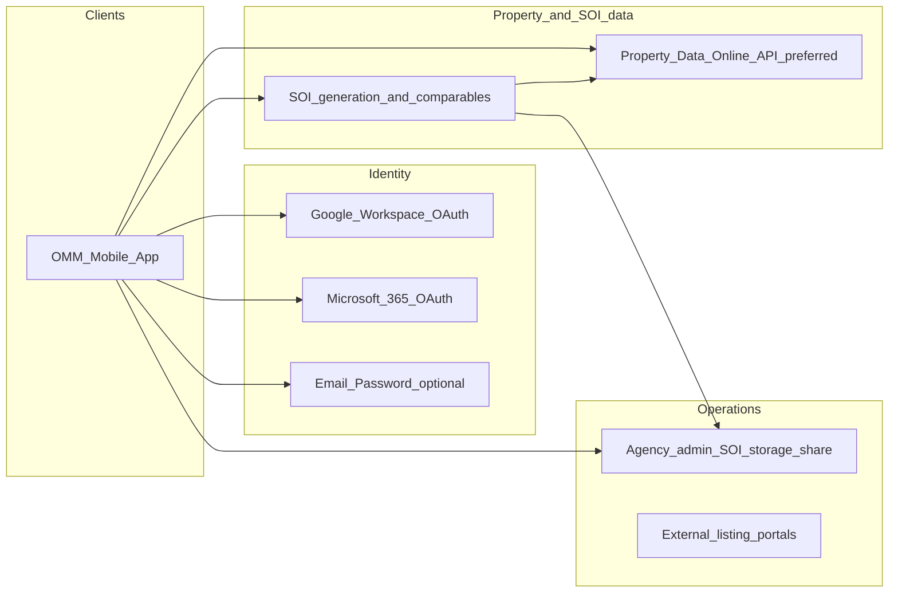

# Off Market Match — architecture & product backlog (meeting notes)

This document translates stakeholder meeting notes into an architecture-oriented requirements view for **Off Market Match (OMM)** — brand, domain, and naming target: **[offmarketmatch.com](https://offmarketmatch.com)**. It is **not** an implementation spec; it informs system design, integrations, and phased delivery.

---

## 1. Purpose and scope

- **In scope**: mobile (and aligned) product behaviour for professional users (**Real Estate Agent**, **Buyer Agent**, **Vendor Advocate**), listing lifecycle, SOI, referrals/commissions, activity, reviews, disputes, payouts, saved properties, and compliance-oriented retention.
- **Out of scope / TBD here**: full legal drafting of Terms/Privacy (tracked as late milestone); commercial billing model (subscription vs per-listing, payor).

---

## 2. System context

High-level actors and dependencies:

**Architecture stance (MVP)**: prefer **documented APIs** (e.g. Property Data Online) over **scraping** for reliability; SOI automation must remain legally defensible and operationally supportable.

---

## 3. Architecture principles

1. **Professional-only access**: signup and sign-in emphasize **work email**; OAuth providers filtered to **business** identities where technically and legally feasible (not consumer Gmail/Hotmail as primary path).
2. **Opaque data sourcing in UX**: enrich listings and SOI from data partners **without** exposing vendor branding (e.g. no “Price Finder” banners or mentions in UI).
3. **Authority-aware economics**: referral and commission presentation must align with **signed authority** and regulatory expectations (underquoting/indicative range rules — detail to be captured with domain experts). Listing/indicative price drives **illustrative AUD** amounts in UI.
4. **Inbound-first matching**: buyer-side agents are alerted; listing agents do not cold-outreach buyer agents (REA-like, anti-spam).
5. **Compliance retention**: account deletion removes **access** but retains **required records** for legal/audit purposes.
6. **REA-like IA + restrained visual design**: functional patterns aligned to established property portals; **Apple-like** simplicity for chrome (no ornamental dashed borders); **professional** accent palette (trial: magenta or corporate blue — not “toy” UI).

---

## 4. Capability map (logical modules)

| Module | Responsibilities |
|--------|------------------|
| **Identity & session** | Google/Microsoft SSO, optional email/password, work-email validation policy, session lifecycle. |
| **Signup & eligibility** | Roles: Real Estate Agent, Buyer Agent, Vendor Advocate; **agency name typeahead/directory** (see §9 open decision); municipality + **multi-location** typeahead; document upload **not** required for MVP signup. |
| **Profile & agent presence** | Public-facing agent profile, stats, reviews presentation (suburb + property type, REA-like). |
| **Listings** | Address-first creation, autofill from property intelligence, editable fields, **land size** and **internal size**, property types including **villa**, **block of units**, consistent **Bedrooms / Bathrooms / Car spaces** labels (no mixed “Beds” vs “Bedrooms”). **No separate property title** field — address is sufficient. |
| **Listing privacy** | **Show/hide exact address**; **approximate map** (radius) for high-end / discreet listings. |
| **SOI** | Workshop-driven end-to-end process with **Astha**; upload **PDF + images**; **auto-generate** MVP with comparables rules; admin share; portal parity. |
| **Referral & commission** | Calculate **commission + referral fees**, dynamic **AUD** in UI; **percentage optional/hidden** where product dictates buyer-facing views. |
| **Saved properties** | Persist favourites; surface **on home**. |
| **Home / dashboard** | **Sold** section; **Manage listings** includes **sold** listings; KPIs (**pending listings**, **commissions**, other TBD metrics); **smaller listing cards** (~half current height) for mobile scanability. |
| **Activity** | Clear separation **events** (e.g. inspections) vs **messages**; filtering/visual distinction. |
| **Reviews** | Eligibility only after **mutually acknowledged deal** on internal property reference; display on profile without exposing full street in public card. |
| **Disputes** | **Property address** (not generic “deal name”); scope to properties with legitimate interaction trace. |
| **Payouts** | **Agency bank account** default; **manual verification** for fraud prevention; **Buyer Agent** sole-trader exception path TBD. |
| **Legal surfaces** | Terms, Privacy, Community Guidelines — **content refresh last** after functional stabilisation. |
| **Design system** | Homepage, listings, profile: **neat, simple, REA-like** consistency; accent colour trials. |

---

## 5. Key flows (sequence-level architecture)

### 5.1 Signup (workforce)

1. Select **role** (exact labels: Real Estate Agent, Buyer Agent, Vendor Advocate).
2. Enter **work email** (copy + validation); optional OAuth (Google Workspace / Microsoft 365) with **personal email blocked** per policy.
3. **Agency**: autofill/search; **directory rule** pending final product decision (§9).
4. **Operating area**: **municipality / LGA** typeahead; **multiple locations**; suburbs/areas selectable as per detailed UX spec.
5. No **verification document upload** required for this phase.

### 5.2 Listing create/edit

1. User types **address**; selects normalized suggestion; **property intelligence** populates fields (source **not** shown in UI). User may **override** all Pulled values.
2. Capture **land size**, **internal size**, type, beds/baths/cars (consistent naming), **free-form numeric pricing** (precise figures; support single figure and range per later legal/UI rules).
3. Optional **address disclosure** mode and **radius map** for anonymous listing presentation.

### 5.3 SOI (MVP)

1. **Discuss and document** end-to-end SOI with **Astha**; define integration contracts (API-first).
2. **Upload** path: PDF **and** images.
3. **Auto-generate** path: agent confirms inputs; **up to 3 comparables** with guardrails; if **&lt;3 comparables**, **mandatory commentary**; search parameters (e.g. **~6 months**, **~2 km**, type, beds, land band) anchored to **agent-corrected** listing facts.
4. Generated SOI: **share/store for admin**; must **match** what is published on portals.
5. **Senuri** track: Property Data Online **API availability, pricing, credentials** vs fragile scrape.

### 5.4 Referral / commission presentation

- Implement **referral commission logic**; auto-compute **commission + referral** amounts from **listing economics** with **AUD** emphasis in UI; **do not rely on percentage display** where product requires simplicity.
- **Note for build**: final rules may require **authority document** as source of truth for commission structure — capture with Anton/Joe/Astha before locking formulas.

### 5.5 Contact listing agent

- **Contact** actions: in-app plus **direct phone/email** where permitted, with **telemetry** (call vs inquire) for product/analytics.

### 5.6 Reviews

- Trigger only after **both parties acknowledge** a completed transaction tied to an **internal property reference**.
- Public profile: **suburb + property type** (REA-like), not full street address on review cards.

### 5.7 Buyer matches / outreach

- **Remove** listing-agent-initiated **Buyer matches** outreach; alerts flow **to** buyer-side agents; they **contact** listing agents when relevant (mirrors REA, reduces spam).

### 5.8 Account deletion

- User loses **access**; **records retained** where law/compliance requires.

---

## 6. Non-functional requirements

| Area | Requirement |
|------|-------------|
| **Reliability** | Prefer **stable APIs** over scraping for core listing/SOI automation. |
| **Security** | Work-email policy; OAuth hardening; payout details protected; manual payout verification initially. |
| **Privacy** | Discreet listing mode; minimal PII on public review cards. |
| **Compliance** | SOI workflow honours jurisdictional rules; audit trail for disputes and transactions. |
| **UX performance** | Home listing cards ~**50%** current vertical size for faster browsing. |

---

## 7. Terminology and naming governance

- App strings and marketing: **Off Market Match** / **OMM** consistency; domain **offmarketmatch.com**.
- In-app language: **real estate industry terminology** throughout (avoid consumer-only wording where misleading).

---

## 8. Dependencies and ownership (from notes)

| Item | Owner / next step |
|------|-------------------|
| SOI end-to-end + integration | **Nimeshan** with **Astha** (workshop); integration logic spec |
| PDO API vs credentials | **Senuri** confirmation |
| Commission/referral domain rules | Product + Anton/Joe (+ Astha where SOI overlaps) |

---

## 9. Open architecture / product decisions

1. **Agency directory strictness**: Notes require **“cannot sign up if agency does not exist”**; earlier workshop discussion allowed **Buyer Agents** without an agency. Architecture should support **role-based rules** (e.g. strict directory for Real Estate/Vendor Advocate; optional or alternate KYB for sole Buyer Agent) — **confirm before schema freezes**.
2. **Listing price vs authority**: Confirm whether **authority** is stored and parsed in-app for commission floors/caps or only reflected indirectly through listing step.
3. **Commercial model**: Subscription vs per-listing; who bills (agent vs agency) — **downstream** to payments architecture.

---

## 10. Traceability — consolidated backlog checklist

Use as epics/tickets in PM tooling (e.g. Linear):

- [ ] Astha: SOI end-to-end + integration logic (API-first).
- [ ] Referral commission logic; **AUD**-first UI; % display per role/surface.
- [ ] Saved properties + **home** entry for saved list.
- [ ] Signup roles: Real Estate Agent, Buyer Agent, Vendor Advocate.
- [ ] Remove dashed borders; **Apple-like** clean layout; **REA-like** pages (home, listings, profile).
- [ ] Google + Microsoft sign-in; **work emails only**; label field **Work email**.
- [ ] Municipality: multi-select / multi-location + typeahead autocomplete.
- [ ] App-wide real estate terminology.
- [ ] Remove verification document requirement (MVP).
- [ ] Remove all **Price Finder** (and similar) mentions from UI.
- [ ] Free-form precise **price** entry (single/range as designed).
- [ ] Listing: **show/hide address** + **radius map** for anonymous view.
- [ ] Agency: auto-populate; **final rule** if agency missing (see §9).
- [ ] Property types: **villa**, **block of units**; **Bedrooms/Bathrooms/Car spaces** consistent; **no property title** — address first.
- [ ] Address selection autofills property fields (editable); include **land** + **internal** size.
- [ ] **Contact** seller/agent: in-app + **phone/email** with tracking.
- [ ] Home: **Sold** section; KPIs (pending listings, commissions, …); **smaller** cards.
- [ ] **Manage listings**: include **sold** listings.
- [ ] Disputes: **property address** not deal name.
- [ ] Payout: **agency bank**; manual verification; Buyer Agent exception path.
- [ ] Colour: accent trial (magenta / corporate blue); professional tone.
- [ ] Terms, Privacy, guidelines — **update last**.
- [ ] Activity: distinguish **events** vs **messages** (inspections etc.).
- [ ] SOI upload: **PDF + images**; auto-generate MVP (comparables, &lt;3 commentary, parameters); admin share + portal match.
- [ ] Integration: **API &gt; scraping**; Senuri: PDO access/pricing.
- [ ] Remove listing-side **buyer match** outreach; inbound alerts only.
- [ ] Reviews: post **mutual deal** only; profile shows **suburb + property type**.
- [ ] Deleted accounts: **retain records**, revoke access.
- [ ] Branding: **OMM** = Off Market Match; **offmarketmatch.com**.

---

*Document generated from meeting notes for architecture and delivery planning. Revise §9 when product decisions close.*
